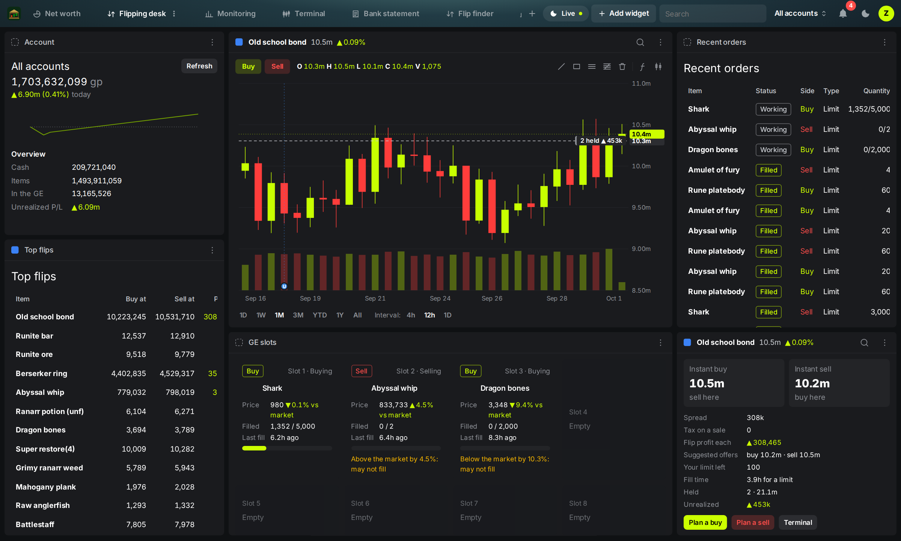

# Bankstanding

*Standing at the bank, professionally.*

A personal, all in one Old School RuneScape market and wealth tool that runs on your own PC.
Bankstanding is the most mocked activity in the game; this is how it becomes your richest skill.
Live Grand Exchange data comes from the OSRS Wiki's free real-time prices API, and stats come
from the official hiscores.

**Account safe by design:** it never sends input to the game, never reads your screen and
never reads game memory. Market data comes from public websites. Your own trades and holdings
come from an optional RuneLite plugin that only listens to RuneLite's own events (the same
way the Loot Tracker and GE history plugins do) and writes them to a file on your PC.

More screenshots (demo data) are in `docs/screenshots`.

## Start it

1. Install Python 3.10 or newer from python.org (tick "Add python.exe to PATH"). No other
   packages are needed.
2. Double-click `start.bat`. The dashboard opens at http://127.0.0.1:8765
3. Leave the black window open while you use it. Close it (or press Ctrl+C) to stop.

The first run downloads the item list, the last 24 hours of hourly prices and the last 6 hours
of 5 minute prices (about 100 small bulk requests, one a second, so under two minutes).
Volumes fill in within a minute; everything is ready once the backfill finishes. After that
only missing windows are fetched.

Want to look around offline? Run `start.bat --demo` for synthetic prices.

## Connect your account (optional, recommended)

The Bankstanding RuneLite plugin (in `runelite-plugin/`) records your GE offers as they fill,
your bank, inventory, equipment, looting bag, seed vault, rune pouch and Death's storage, loot
and XP. With it running, the Net worth tab shows your whole account valued live, and every GE
trade lands in the flip log on its own. Nothing is sent anywhere: the plugin writes to
`.runelite/bankstanding` in your user folder and this app reads it.

1. Install Java 17 or newer (Adoptium Temurin is free; Java 25 works).
2. Double-click `runelite-plugin/run-plugin.bat` (or run `gradlew run` in that folder). The
   first run downloads RuneLite's libraries, then opens RuneLite with the plugin loaded.
   If you log in with a Jagex account, follow RuneLite's guide for using a Jagex account with
   a development client (it is a one time setup of the launcher's credentials).
3. Log in, open your bank once, and open the Grand Exchange once. After that it is automatic.

Accuracy notes:
* The bank is only counted once you have opened it with the plugin running, and refreshes
  each time you open it. The Net worth tab shows what the plugin has seen and when.
* Offers that fill while you are logged out are caught up at your next login, timed at the
  login (marked "caught up").
* Average cost and profit or loss: GE buys use what you actually paid. Items you already had
  (or got from drops) are given their value on the day the plugin first saw them, marked *
  in the holdings table, so their profit or loss counts from the day tracking began.
* Untradeable items have no GE price, so they are listed but count as 0.
* Storage the plugin cannot see (costume room, STASH units, other accounts without the plugin)
  can be added by hand on the Portfolio tab and included in the all accounts total.
* The plan is to submit the plugin to the Plugin Hub once it has been used for a while, so it
  can be installed from inside the normal RuneLite client.

## What's in it

| Tab | What it does |
| --- | --- |
| Bank statement | What changed since you last looked: net worth and where the change came from, GE fills and completed offers, anything the offer coach flags, your biggest movers, news about what you hold, buy limits that reset, alerts, and the best ideas right now. Can also be sent to your phone every morning. |
| Goals and income | Targets (a net worth, or an item to afford at its live price) with the date you reach them at your real pace, plus cautious and hopeful dates and what a deadline needs. Where your gp comes from per hour played (trading edge, market moves, loot, skilling and spending), loot by source, clue casket values by tier, and all your price targets. |
| Net worth | Your whole account like a brokerage portfolio: total value live (after tax by default), changes over 24 hours, 7 and 30 days and since tracking began, value over time (with today's holdings at past prices for context), allocation by class, location and item, every holding with its share, 24h move, average cost and unrealized profit, your 8 GE slots live with fill progress and a warning when an offer is priced away from the market, recent trades and loot, and recommendations to add value (idle cash with free slots, offers that will not fill, items worth more alched, decanted, combined or split into sets, or processed, and concentration risk), each labelled exact, estimate or history. Performance against a market index with the change split into market moves, trading, loot and other (so income does not count as performance), a risk panel (typical daily swing, a bad day and a bad week, worst drawdown, beta, diversification, how much could be sold in a day, and which holdings drive the risk), and a heatmap of your holdings. Works across several accounts. |
| Layouts | Workspaces like Robinhood Legend's: each layout is a header tab holding a grid of widgets you drag (by the header), resize (bottom right corner), add ("Add widget") and remove. Widgets: account, chart, positions, recent orders (working, filled, canceled), market movers with sparklines, watchlist, GE slots, quote, news, offer coach, top flips, market heatmap, performance, or any page. Colored link squares group widgets so they all follow the same item; clicking a row in one sets the item for the whole group, in every layout and in other windows ("Open in a new window" on the layout menu, for a second monitor). The blue group also drives the Terminal. Start from a template (Flipping desk, Portfolio, Chart spotlight, Positions analysis, Positions monitoring, Watchlist monitoring, Market monitoring, News desk) or a blank layout; right click a layout tab (or its menu) to rename, duplicate, open in a new window or delete it. Layouts are saved in the browser. |
| Terminal | A trading desk in the style of Robinhood Legend where every panel follows one item: a watchlist (or your holdings, gainers, losers, top markets), a candle or line chart with ranges from 1D to All and an interval picker (5m to 1W), moving averages, VWAP, Bollinger bands, RSI, MACD, volume, news flags, a comparison with the market index, the guide price or another item, drawings (trend lines, rectangles, price levels, Fibonacci retracements; right click one to delete it), your GE offers, average cost and price targets drawn on the chart, Buy and Sell buttons and a "+" on the price axis that plan a price target (Bankstanding never places offers); a quote panel with suggested offers, tax, limit left and fill time; your position, cost and GE offers; key stats (1 year range, daily swing, beta); and news, how the item moved around past posts, the indicator signals firing on it now with how those signals have done historically, and your trades. Keyboard: / search, J and K move, 1 to 7 range, C chart type, D price level tool, Esc done drawing, W watch, L layout. |
| News | Game updates, developer blogs, polls and Jagex news, tagged with the items they mention (yours highlighted), plus an event study: how mentioned items moved beyond the market the week before, the day of, and the week and month after posts, compared with ordinary days. |
| Flip finder | Every item ranked by profit after the 2% GE tax, with a realistic fill estimate, hours to fill a limit, margin stability, a stability-adjusted 4 hour profit, and the buy limit you have left. Margin traps (prices that traded far apart, or margins recent history says don't hold) are flagged and hidden by default. Presets, plus a slot planner that fills your GE slots for a given cash stack. |
| Market | A heatmap of the 200 biggest markets grouped by class and colored by the day's move. Price indices (start = 100) for the whole market and for runes, logs, ores, herbs, potions, seeds, bones, food, ammo, gems, hides and big ticket items, each charted against the market. Advancers and decliners, the typical move, and the biggest markets by gp traded. |
| Movers | Biggest gainers and losers over 1h, 6h, 24h, 7d, plus unusual volume spikes with pump and dump flags. |
| Watchlist | Starred items with 24h sparklines, live margins and stability. |
| Alerts | Price, profit, ROI, 1h move, rise, drop, volume, stability, spike and dump. Combine conditions with AND, point an alert at every watchlist item at once, and get desktop notifications when the tab is in the background. Buy limit resets are announced too. |
| Flip log | Real buys and sells with profit after tax (recorded automatically from your GE trades with the plugin, first in first out, with a "Not a flip" switch for items you bought to use), strategy tags and an edge report (what works by strategy, item, price band and hold time, and whether you buy under and sell over the market), an equity curve, worst drawdown, profit by day, hour and weekday, hold times, your buy and sell edge vs the market, buy limits in use, and CSV export. |
| Portfolio | Holdings and cash stack valued live, unrealized profit, 24h change, allocation, open flips, and an hourly net worth chart. Paste a list like `2 x Abyssal whip` to import. |
| Money making | About 220 processing and skilling methods (including Barrows repair, bolt tipping and enchanting, and gold jewellery) priced live and ranked by GP per hour (herblore, crafting, fletching, smithing, cooking, construction and more), with buy limit caps, GP per XP, your own rates, and your own custom recipes. Item set arbitrage for about 100 sets, both combining and splitting. |
| High alch | Profit per cast after the nature rune, GP per XP, profit per buy limit. |
| Decanting | Cheapest dose per potion to buy and decant to 4-dose at Bob Barter, with profit per limit. |
| Forecast | Expected flip profit per item over the next 7, 30 or 90 days, from demand (instant-buy and instant-sell volume), today's margin fading toward its usual level, and a price trend that is only used when it beat "no change" on recent days. A simulation of the item's own past good and bad days gives a likely range and the chance of a loss, plus what holding one limit would return instead. |
| Forecast: holding outlook | For anything you hold (or any item): do its trends support keeping it, and what is it likely to be worth in 7, 30 and 90 days after tax, with a likely range and the chance it rises. Built from two years of the whole market and tested on months it never saw; it only uses trend signals that proved themselves on that test, and says plainly when none did. Also shows each item's own record and trend facts, and an outlook column on the Portfolio tab. |
| Backtest | Paper trade any rule (a forward test on prices after you save it). Replay a rule (buy the dip, buy dumps, margin flips, breakouts, RSI, moving average cross, Bollinger) over your saved hourly history: trades, win rate, returns, drawdown, equity curve, return histogram, best items, and a comparison with just holding. Plus "Do chart indicators work in OSRS?": eight classic signals replayed over the daily history after tax, against the market and a random day, and only trusted if they worked in both the older and newer half. |
| Account | Hiscores lookup (regular, iron, hardcore, ultimate), XP and kill count gains over time, goals with pace, ETA and the cheapest ways to get there at live prices, a drop log with loot value per boss, and dry streak odds for the items you are chasing. |
| Item panel | Click any item: prices, tax, ROI, stability, fill time, your buy limit, break-even sell price, charts from 6 hours to 1 year, the best hour and weekday to buy and sell, items that move with it, and recipes and sets it belongs to. |

## Good to know

* **Price terms.** "Instant buy" is the latest price someone paid to buy instantly, so it's
  roughly what you can sell for. "Instant sell" is roughly what you can buy for with a patient
  offer. Flip profit = instant buy minus tax minus instant sell.
* **GE tax.** 2%, rounded down, capped at 5m per item, nothing under 50 gp, and the Wiki's
  exempt list (bonds, some food, teleports, tools). Edit `data/config.json` if Jagex changes it.
* **Your own history.** The app saves every 5 minute window (kept 7 days) and every hourly
  window (kept 1 year) while it runs. That's the data paid trackers usually charge for, and
  it feeds stability, timing, indices, correlations and backtests. The 5 minute history levels
  off around 100 MB; hourly history adds roughly 2 MB a day. Change how long each is kept in
  Settings, or raise History backfill (up to 30 days) for longer analytics from day one.
* **Fills are shared.** Other flippers compete for the same trades, so estimates assume you
  win a share (20% by default, in Settings) of the volume you buy from and sell into.
* **Market history import.** On first start the app also imports two years of daily prices and
  volumes for every item (730 bulk requests, one a second, in the background). The forecast
  uses it, and the Forecast tab can backtest and re-tune itself on it. Change the number of
  days in Settings, or set it to 0 to skip.
* **Offer coach.** Flags a buy or sell that has sat unfilled while the market moved (with the
  price that should fill and roughly how long it takes), offers priced well through the
  market, positions now below break-even (with how often the item recovered that much within
  a week before), and items you hold or watch that look like a pump.
* **Your real fill rates.** Estimates start from a 20% share of the market. Once the plugin has
  seen enough of your offers, the app measures your actual share per item and uses that.
* **Phone.** Settings can send GE fills, alerts, coach warnings, limit resets and the daily bank
  statement to Discord (your own webhook) or the ntfy app. It can also let your phone open the
  dashboard on home Wi-Fi with a password.
* **RuneLite side panel.** The plugin adds a panel showing your net worth, suggested buy and
  sell prices for the item you have open on the GE screen, and offers that need attention.
  It only displays information; you place every offer yourself.
* **News.** On first start the app also reads two years of update posts from the OSRS Wiki
  (about 40 bulk requests, one a second) and then checks Jagex's news feed every 30 minutes.
  Set `news_enabled` to false in `data/config.json` to turn it off.
* **Backups.** A copy of the database is saved to `data/backups` once a day (the last 7 are
  kept). Settings has Back up now and a JSON export of everything you entered.
* **Estimates, not guarantees.** Prices come from trades seen by RuneLite users. Price check
  in game before big flips.
* **Be polite to the Wiki.** In Settings you can add your Discord name to the User-Agent so
  the Wiki team can reach you about API changes. Refresh can't go below 30 seconds.

## Files

* `run.py` starts everything. `geco/` is the engine (Python standard library only).
* `runelite-plugin/` is the RuneLite plugin (Java, built with Gradle).
* `web/` is the dashboard. `data/` holds your settings, database, backups and cached item list.
  Back up `data/ge_companion.sqlite3` to keep your flip log, portfolio, alerts and history.
* `tests/` has the unit tests: `python -m unittest discover -s tests`.

## Next up

Guide price tracking, a clue scroll reward value table, and custom item categories for the
market indices.
